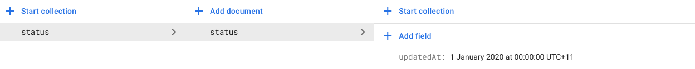

# Firestore Cache

A Flutter plugin for fetching Firestore documents with read from cache first then server.

[](https://pub.dartlang.org/packages/firestore_cache)
[](https://pub.dev/documentation/firestore_cache/latest/)
[](https://github.com/zeshuaro/firestore_cache/blob/master/LICENSE)

This plugin is mainly designed for applications using the `DocumentReference.get()` and `Query.getDocuments()` methods in the `cloud_firestore` plugin, and is implemented with read from cache first then server.

## Getting Started

__WARNING__ `cloud_firestore 0.14.0` introduced a lot of breaking changes, `firestore_cache 0.2.0` has been update to work with these latest changes. Please use `firestore_cache 0.1.1` for `cloud_firestore` versions prior to `0.14.0`.

Add this to your package's `pubspec.yaml` file:

```yaml
dependencies:
  firestore_cache: ^0.2.0
```

### Usage

Before using the plugin, you will need to create a document on Firestore and create a timestamp field in that document. See the screenshot below for an example:



__PLEASE NOTE__ This plugin does not compare the documents in the cache and the ones in the server to determine if it should fetch data from the server. Instead, it relies on the timestamp field in the document to make that decision. And so your application should implement the logic to update this field if you want to read new data from the server instead of reading it from the cache.

You should also create different timestamp fields for different collections or documents that you are reading.

```dart
import 'package:firestore_cache/firestore_cache.dart';
import 'package:cloud_firestore/cloud_firestore.dart';

// This should be the path of the document that you created
final DocumentReference cacheDocRef = Firestore.instance.doc('status/status');

// This should be the timestamp field in that document
final String cacheField = 'updatedAt';

final Query query = Firestore.instance.collection('collection');
final QuerySnapshot snapshot = await FirestoreCache.getDocuments(
    query: query,
    cacheDocRef: cacheDocRef,
    firestoreCacheField: cacheField,
);
```

### Documentation

The documentation of `firestore_cache` is available [here](https://pub.dev/documentation/firestore_cache/latest/).